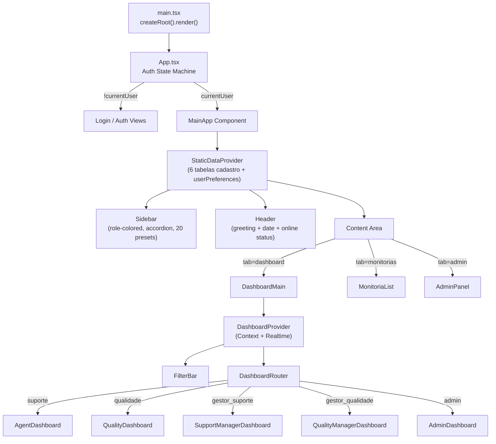

# Arquitetura Frontend

## Stack

| Tecnologia | Versão | Propósito |
|---|---|---|
| React | 19.x | UI Framework |
| TypeScript | ~5.8 | Tipagem estática |
| Vite | 6.x | Bundler + Dev Server |
| TailwindCSS | 4.x | Utility-first CSS (CSS-native, `@theme`) |
| Motion | 12.x | Animações (Framer Motion) via `motion/react` |
| Recharts | 3.x | Gráficos de dashboard (AreaChart, BarChart, PieChart) |
| Lucide React | — | Ícones SVG (única lib permitida) |
| Sonner | 2.x | Toast notifications |
| date-fns | — | Formatação de datas (locale pt-BR) |
| clsx + tailwind-merge | — | Merge condicional de classes |

## Estrutura de Pastas

```
src/
├── App.tsx # Entry point: Auth + Layout + Tab Navigation + Session + Sidebar Accordion
├── main.tsx                         # React DOM render
├── index.css # Design tokens + CSS global (Tailwind v4 @theme) + date picker color-scheme
├── types.ts                         # Tipos TypeScript globais (User, Monitoria, Team, etc.)
├── lib/ 27: │   ├── supabase.ts # Cliente Supabase + MockDB (localStorage) + upsertUserPreferences() 28: │   ├── useQualityConfig.tsx # Context Provider singleton + hook de config de qualidade 29: │   ├── businessHours.ts # Utilitários de horário comercial/prazo de ação 30: │   ├── contestation.ts # Funções unificadas de contestação (isApprovalAction/isRejectionAction) 31: │   ├── chartColors.ts # Utilitário de cores de gráfico (lê CSS vars, theme-aware) 32: │   └── StaticDataContext.tsx # Context Provider — cadastro (6 tabelas) + userPreferences
├── utils/                           # (Vazio — não utilizado atualmente)
└── components/
    ├── AdminPanel.tsx               # Painel administrativo (222 linhas, 6 sub-tabs)
    ├── MonitoriaForm.tsx            # Formulário de monitoria multi-step (684 linhas)
    ├── MonitoriaList.tsx            # Lista de monitorias com ações (676 linhas)
    ├── QualityConfigManagement.tsx  # Config de qualidade/prazo de ação
    ├── ui/                          # Componentes UI reutilizáveis
    │   ├── Badge.tsx
    │   ├── Button.tsx
    │   ├── Card.tsx
    │   ├── CustomSelect.tsx         # Select dropdown com portal + type-ahead (filtro por digitação)
    │   ├── Select.tsx               # Select nativo estilizado
    │   └── ActionDeadlineClock.tsx  # Relógio de prazo de ação com contagem regressiva
    ├── dashboard/
    │   ├── DashboardMain.tsx        # Router de dashboard por role
    │   ├── DashboardContext.tsx     # Context Provider com dados, filtros, RBAC e presença online
    │   ├── FilterBar.tsx            # Barra de filtros global
    │   ├── roles/                   # Dashboards específicos por perfil
    │   │   ├── AdminDashboard.tsx
    │   │   ├── AgentDashboard.tsx
    │   │   ├── QualityDashboard.tsx
    │   │   ├── QualityManagerDashboard.tsx
    │   │   └── SupportManagerDashboard.tsx
    │   └── widgets/                 # Componentes de visualização reutilizáveis
    │       ├── ComparativeBarChart.tsx  # Ícone: BarChart3 (brand-muted)
    │       ├── DistributionChart.tsx   # Ícone: PieChartIcon (brand-accent)
    │       ├── OfensoresChart.tsx      # Ícone: AlertOctagon (functional-error)
    │       ├── RankingWidget.tsx       # Props: accent (text-*→bg-* via getIconBg)
    │       ├── RecentAuditsTable.tsx   # Ícone: ClipboardList (brand-muted); Clock p/ auto-conclusão
    │       ├── ActionDeadlineWidget.tsx # Ícone: Clock (functional-warning)
    │       ├── StatCard.tsx            # Props: icon, accent; getIconBg() map
    │       └── TrendChart.tsx          # Ícone: TrendingUp (brand-highlight)
    └── admin/                       # Sub-componentes do AdminPanel
        ├── UsersManagement.tsx      # syncUserTeams() para N:N user_teams
        ├── TeamsManagement.tsx
        ├── FormsManagement.tsx      # Auto-save drafts em localStorage
        ├── RequestsManagement.tsx
        └── DissatisfactionFieldsManagement.tsx
```

## Gerenciamento de Estado

QualiTrack **não usa** nenhuma biblioteca de estado global (Redux, Zustand, etc). O estado é gerenciado em múltiplos níveis:

### 1. Estado de Aplicação (`App.tsx`)
Estado raiz que controla:
- `currentUser` — Sessão Supabase Auth ativa
- `userData` — Dados do usuário da tabela `users` (enriquecido com `team_ids` via `enrichUserWithTeamIds()`)
- `activeTab` — Tab ativa (`dashboard` | `monitorias` | `admin`)
- `theme` — Tema (`'light'` | `'dark'` | `'system'`) — respeita preferência salva quando logado, segue o sistema quando deslogado
- `isFormOpen` — Modal de nova monitoria
- `authView` — View de autenticação (`login` | `request-access` | `pending` | `change-password` | `forgot-password` | `setup-password`)
- `showIdleWarning` — Modal de aviso de inatividade (5 min countdown)
- `idleCountdown` — Segundos restantes no countdown de inatividade
- `isSidebarOpen` — Estado da sidebar (260px aberta / 80px recolhida)
- `sidebarAccordion` — Seção aberta no popover do perfil (`'teams' | 'avatar' | 'appearance' | 'color' | null`). Apenas 1 seção aberta por vez.
- `isSystemOnline` — Status de conectividade de rede
- `isReconnecting` — Indicador de tentativa de reconexão ativa

### 2. Dados Estáticos / Cadastro (`StaticDataContext.tsx`)

Context Provider que envolve `<MainApp>` em `App.tsx` (filho de `<QualityConfigProvider>`). Faz **1 único fetch** de 6 tabelas em paralelo:

- `users` — enriquecidos com `team_ids` via `enrichUsersWithTeams()` e `preferences` via `prefsMap`
- `teams`
- `forms`
- `dissatisfaction_fields`
- `user_teams` — usado para mapeamento N:N
- `user_preferences` — mapeado em `prefsMap: Record<string, UserPreferences>` e injetado em cada `User.preferences`

**Travas contra fetch storms:**
- `fetchingRef` — impede fetch paralelo (StrictMode double-render, re-renders rápidos)
- `fetchedRef` — impede re-fetch quando dados já estão disponíveis
- `refreshAll()` — trigger manual via `refreshTrigger` (nunca auto-disparado)

**Consumidores**: `MainApp` (sidebar, theme sync), `DashboardContext`, `MonitoriaList`, `MonitoriaForm`, `AdminPanel`. Nenhum componente faz fetch independente dessas tabelas.

### 3. Estado do Dashboard (`DashboardContext.tsx`)
Context Provider que centraliza:
- `filters` — Filtros globais (data, equipe, agente, auditor, status, canal) — debounced 300ms
- `monitorias` — Lista filtrada (RBAC + filtros UI)
- `allMonitorias` — Lista completa pós-RBAC (antes de filtros UI)
- `users`, `teams`, `forms` — Dados de referência via `useStaticData()` (não faz fetch próprio)
- `globalAvg` — Média global de score (date/status/channel filtered, NOT RBAC-scoped)
- `loading`, `refresh` — Controle de loading e refresh
- `onlineUsers` — Usuários online (merge local + Supabase Presence)
- `dissatisfactionFields` — Definições de campos de insatisfação
- Realtime subscription no canal `monitorias-realtime-dash` (300ms debounce)
- Reload triggers: `activeTab` change, `qualitrack:reconnected`

**Travas contra fetch storms:**
- `fetchingRef` — impede fetch paralelo de monitorias (re-entrant guard)
- `hasLoadedOnce` — distingue primeira carga de reloads silenciosos
- `userRef`, `filtersRef`, `staticDataRef` — estabilizam callback `loadData`, evitam cascade re-renders
- Realtime `deps=[user]` — canal reconecta apenas quando usuário muda, callback via `loadDataRef`

### 4. Configuração de Qualidade (`QualityConfigProvider` — `useQualityConfig.tsx`)
Context Provider singleton que envolve `<MainApp>` em `App.tsx`:
- Faz **1 único fetch** a `quality_configs` (Supabase ou mockDb) no mount
- Fornece `config`, `oldConfig`, `saveConfig`, `getLevelForScore`, `isAboveTarget`, `recalculateActiveActionDeadlines`
- Consumido por 9+ componentes via `useQualityConfig()` hook (não há mais fetches independentes por componente)
- Cores de nível usam classes `text-level-*`/`bg-level-*` com `.dark` overrides (pastel)

### 5. Estado Local (Componentes)
Cada componente major (AdminPanel, MonitoriaForm, MonitoriaList) mantém seu próprio estado local via `useState`.

### 6. Gerenciamento de Sessão (`App.tsx`)

O `App.tsx` implementa um sistema unificado de gerenciamento de sessão com 4 mecanismos:

| Mecanismo | Constante (escopo do módulo) | Valor | Descrição |
|-----------|------------------------------|-------|-----------|
| Idle timeout | `IDLE_TIMEOUT_MS` | 60 min | Sem atividade → logout automático |
| Idle warning | `IDLE_WARNING_MS` | 5 min | Modal com countdown 5 min antes do logout |
| Absolute timeout | `ABSOLUTE_TIMEOUT_MS` | 8 h | Sessão contínua máximo 8h → logout forçado |
| Proactive refresh | `SESSION_REFRESH_MS` | 50 min | `supabase.auth.refreshSession()` a cada 50min |

**Constantes no escopo do módulo**: `IDLE_TIMEOUT_MS`, `IDLE_WARNING_MS`, `ABSOLUTE_TIMEOUT_MS`, `SESSION_REFRESH_MS`, `MOCK_SESSION_KEY` e `LAST_ACTIVITY_KEY` são declaradas **fora** do componente `App()` para estarem disponíveis em inicializadores de `useState`.

**Refs de sessão**:
- `sessionStartTimeRef` — Timestamp de início da sessão (8h limit)
- `isCleaningSessionRef` — Previne race condition em logout forçado
- `extendSessionRef` — Ponte entre `useEffect` e `useCallback` (ref-bridge pattern)
- `isPasswordRecoveryRef` — Gates entre recovery e invite no change-password
- `isInviteFlowRef` — Detecta `type=invite` no hash para fluxo de convite

**Persistência de sessão (F5)**:
- **Supabase**: SDK `persistSession: true` + `localStorage` — evento `INITIAL_SESSION` com session restaura login
- **Mock**: `localStorage` chave `qualitrack_session` (`{userId, sessionStartedAt, sessionExpiresAt}`)
- **Last Activity**: `localStorage` chave `qualitrack_last_activity` — timestamp da última interação. Ao restaurar sessão (F5), o sistema verifica se `Date.now() - lastActivity >= 60min` (idle) ou `Date.now() - sessionStartedAt >= 8h` (absolute). Se expirado, sessão descartada e usuário redirecionado ao login.

**Resiliência de sessão**:
- Heartbeat ping ao Supabase a cada 2 min
- Reconexão agressiva (5s polling) quando offline
- `visibilitychange`: ao focar aba, verifica expiração e dispara refresh
- Event listeners `online`/`offline`
- Evento customizado `qualitrack:reconnected` para reload de dados

**Presença online**:
- Local: `localStorage` chave `qualitrack_active_sessions` — heartbeat 10s, timeout 25s
- Supabase: Presence channel `'online-presence'` com `track()` on subscribe
- Merge: local-first, remote overwrites; deduplicado por user ID

**Enriquecimento de equipe**: `enrichUserWithTeamIds()` consulta a tabela N:N `user_teams` e injeta `team_ids` no `userData` em todas as entradas: login, restauração de sessão e `handleUserSession`. A coluna `users.team_ids` foi removida (migration M5) — nunca enviar `team_ids` em payload Supabase da tabela `users`.

**`handleLogout(options?)`**: Aceita `{ silent?, message? }` para evitar que `MouseEvent` (de `onClick={handleLogout}`) seja passado como string para Sonner. Limpa `MOCK_SESSION_KEY`, `LAST_ACTIVITY_KEY` e `qualitrack_theme` do `localStorage`. Reseta `lastDbThemeRef.current = null` e `setTheme('system')`.

### 7. Preferências de Usuário (`user_preferences`)

A tabela `user_preferences` (JSONB) é a **fonte de verdade** para preferências de UI (tema, cor do sidebar, avatar). O fluxo otimizado:

**Leitura (pós-login / F5):**
1. `StaticDataContext` faz 1 fetch paralelo de `user_preferences` junto com as outras 5 tabelas de cadastro
2. Os dados são expostos como `userPreferences: Record<string, UserPreferences>` no context
3. `MainApp` lê `userPreferences[userId]` para sincronizar tema e sidebar_color — **nunca faz fetch independente**
4. `lastDbThemeRef` (module-level) é setado **antes** de `setTheme()` para prevenir auto-save loop

**Escrita (explicit user action only):**
1. Tema: `App.tsx` theme effect salva via `upsertUserPreferences()` **apenas** quando `resolved !== lastDbThemeRef.current` (guard contra write-back do valor recém-lido do banco)
2. Sidebar color: `handleSidebarColorChange()` salva via `upsertUserPreferences()` — só dispara por click do usuário
3. Primeiro login (sem preferência no banco): resolve OS (`prefers-color-scheme`) → salva `'light'` ou `'dark'` (nunca `'system'`)
4. Fallback `user_metadata.sidebar_color`: migrado automaticamente para DB na primeira leitura

**Travas contra auto-save loop:**
- `lastDbThemeRef` — module-level object compartilhado entre `App` e `MainApp`. Setado antes de `setTheme()` na sincronização do banco, verificado no theme effect antes de `upsertUserPreferences()`
- Logout reseta `lastDbThemeRef.current = null` em todas as 3 saídas (manual, idle timeout, absolute timeout)
- `upsertUserPreferences()` faz JSONB merge (read existing → spread partial → upsert), nunca sobrescreve chaves não-relacionadas

**`localStorage` como cache instantâneo:**
- `qualitrack_theme` — resolve flash de tema no F5 (blocking `<script>` em `index.html` lê antes do React)
- `qualitrack_sidebar_color_{email}` — cache local da cor do sidebar
- Ambos são limpos no logout (DB preserva para o próximo login)

## Navegação / Roteamento

**Não há router library** (React Router, etc). A navegação é controlada por:

```
App.tsx (activeTab state)
├── 'dashboard' → DashboardMain → DashboardRouter (switch por role)
├── 'monitorias' → MonitoriaList
└── 'admin' → AdminPanel (apenas para role='admin')
```

- Dentro de `AdminPanel`, 6 sub-tabs: `users` | `teams` | `forms` | `requests` | `qualidade` | `campos_extras`
- Dentro de `DashboardMain`, roteamento automático por `user.role`
- **Proteção**: `useEffect` reseta `activeTab` de `'admin'` para `'dashboard'` se role não for admin
- Content switching via CSS `hidden`/`block` (não conditional rendering)

> **Consequência**: Não há URLs distintas, deep-linking ou browser history. Toda navegação reseta ao recarregar a página.

## Design System

### Tokens (CSS Custom Properties)

Definidos em `src/index.css`, com variantes light/dark:

| Token | Light | Dark | Uso |
|-------|-------|------|-----|
| `--brand-primary` | `#2D3A3A` | `#F9F9F6` | Texto principal |
| `--brand-accent` | `#8E9B7B` | `#8E9B7B` | Accent/CTA |
| `--brand-muted` | `#7A7D71` | `#A3A69A` | Texto secundário |
| `--surface-bg` | `#F9F9F6` | `#1A1C16` | Background geral |
| `--surface-card` | `#FFFFFF` | `#252820` | Background de cards |
| `--surface-border` | `#E2E4D8` | `#3D4136` | Bordas |

### UI Patterns
- **Sidebar Contrast**: Implementação dinâmica baseada em luminância (YIQ). Calcula se o `sidebarColor` é claro ou escuro e alterna entre `text-white` e `text-slate-900`.
- **Date Picker Flash Fix**: Aplicação de `style={{ colorScheme: resolvedTheme }}` inline nos inputs de data para garantir o esquema correto no primeiro frame de pintura do Chromium. Regra global `html:not(.dark) input[type='date'] { color-scheme: light !important; }` em `index.css` como fallback de segurança.

### Cores Funcionais
| Nome | Uso | Token |
|------|-----|-------|
| success | Ações positivas, aprovações | `text-functional-success` / `bg-functional-success` |
| warning | Alertas, pendências | `text-functional-warning` / `bg-functional-warning` |
| error | Erros, rejeições, exclusões | `text-functional-error` / `bg-functional-error` |

### Cores de Nível de Qualidade (Pastel no Dark Mode)
| Classe | Uso | Dark Override |
|--------|-----|---------------|
| `text-level-excelente` / `bg-level-excelente` | Faixa Excelente | Cor pastel |
| `text-level-aceitavel` / `bg-level-aceitavel` | Faixa Aceitável | Cor pastel |
| `text-level-atencao` / `bg-level-atencao` | Faixa Atenção | Cor pastel |
| `text-level-ruim` / `bg-level-ruim` | Faixa Ruim | `#FCA5A5` (pastel) |
| `text-level-roxo` / `bg-level-roxo` | Status aguardando gestor qualidade | Cor pastel |

### Mapeamento de Perfis (`ROLE_LABELS`)
Os perfis de usuário (roles) são mapeados de IDs técnicos para nomes amigáveis em `src/types.ts`:
- `admin` ➔ **Administrador**
- `qualidade` ➔ **Monitor de Qualidade**
- `gestor_qualidade` ➔ **Supervisor de Qualidade**
- `gestor_suporte` ➔ **Supervisor de Atendimento**
- `suporte` ➔ **Agente de Atendimento**

### Ícones do Dashboard — Categorias Semânticas
| Categoria | Ícone | Cor de Acento |
|-----------|-------|---------------|
| Score/Nota | `Target` | Derivada do nível (level-*) |
| Volume | `ClipboardCheck` | `text-brand-accent` |
| Pendência | `AlertTriangle` | `text-functional-error` ou `text-functional-warning` |
| Aprovação | `CheckCircle2` | `text-functional-success` |
| Rejeição | `XCircle` | `text-functional-error` |
| Tendência | `TrendingUp` | `text-brand-highlight` |
| Info/Contexto | `Users`, `History`, `ClipboardList` | `text-brand-muted` |

> **StatCard** e **RankingWidget**: a cor de fundo do ícone deriva do accent via `getIconBg()` — mapeia `text-*` → `bg-*` automaticamente. `text-level-*` mapeia para `bg-level-*`.

### Padrões de Layout e Animação
- **Sidebar Dinâmica:** Largura variável (80px recolhida / 260px aberta) controlada por `motion.aside`.
- **Sincronização de Texto:** Rótulos dos menus e seção de perfil utilizam contêineres com `overflow-hidden` e transições de `max-width` sincronizadas em 300ms para evitar transbordo durante a animação.
- **Sidebar Text Flicker Fix:** `sidebarTextVisible` state — texto esconde imediatamente ao colapsar, aparece somente após `onAnimationComplete`.
- **Perfil do Usuário:** Seção de perfil utiliza `layout` animation do Framer Motion para alternar entre `flex-row` (aberta) e `flex-col` (recolhida), permitindo que o botão de logout fique abaixo do ícone no modo compacto.
- **Quebra de Texto:** Nomes e cargos suportam `break-words` para evitar quebra de layout com nomes extensos.
- **Sidebar Accordion:** Popover de perfil com 4 seções recolhíveis (Equipes, Avatar, Aparência, Cor do Menu). Padrão single-open via `sidebarAccordion` state. Usa `AnimatePresence initial={false}` + `motion.div` para smooth height animation. `ChevronDown` com `rotate-180` transition. Seleção de cor auto-fecha o accordion. Sem botão X — fecha ao clicar fora ou no toggle do perfil.
- **Profile Toggle:** Botões de avatar e nome no sidebar usam classe `profile-toggle-btn` para exclusão do click-outside handler. Toggle abre/fecha o popover corretamente sem conflito com o handler de click-outside.
- **Color Picker:** Um dos 4 accordion sections. 20 presets de cor, persistidos via `upsertUserPreferences()` na tabela `user_preferences` (JSONB `sidebar_color`). Cache local em `localStorage` (`qualitrack_sidebar_color_{email}`). Fallback: `user_metadata.sidebar_color` migrado para DB automaticamente. Seleção auto-fecha o accordion.
- **Date Picker (Dark Mode):** `input[type="date"]` usa `color-scheme: var(--date-color-scheme, light)` com `.dark` override `--date-color-scheme: dark` em `index.css`. Previne flash preto ao abrir calendário em light mode.
- **Scrollbar Gutter:** Container de scroll principal usa `scrollbar-gutter: stable` (inline style) para evitar layout shift quando scrollbar aparece/desaparece.

### Tipografia
- **Fonte**: Inter (Google Fonts) com fallback para system-ui
- **Pesos usados**: 400, 500, 600, 700, 800, 900

### Padrões UI Recorrentes
- **Cards**: `rounded-3xl` ou `rounded-[32px]` com `border border-surface-border shadow-premium`
- **Botões**: `rounded-2xl` com `font-black uppercase tracking-widest`
- **Inputs**: `rounded-2xl` com `bg-surface-subtle border border-surface-border`. Para `input[type="date"]`, usar `color-scheme: var(--date-color-scheme, light)`.
- **Labels**: `text-[10px] font-black uppercase tracking-widest text-brand-muted`
- **Modais**: `fixed inset-0 bg-black/40 backdrop-blur-sm` com card central
- **Animações**: `motion/react` para enter/exit de componentes. Sidebar accordion usa `AnimatePresence initial={false}` com smooth height animation.

## Componentes UI (`src/components/ui/`)

| Componente | Descrição |
|---|---|
| `Card` | Container com padding, borda e shadow |
| `Button` | Botão com variantes: primary, secondary, outline, ghost |
| `Badge` | Tag com variantes: success, error, warning, info, neutral |
| `Select` | `<select>` nativo estilizado |
| `CustomSelect` | Dropdown customizado com portal (evita clipping) + type-ahead (filtro por digitação, case-insensitive). Trigger: `<div>` com `<input>` inline |
| `ActionDeadlineClock` | Relógio de contagem regressiva de prazo de ação (cores: verde >50%, amarelo 25-50%, vermelho <25%) |

## Fluxo de Renderização


